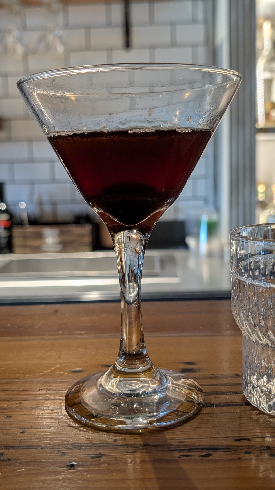
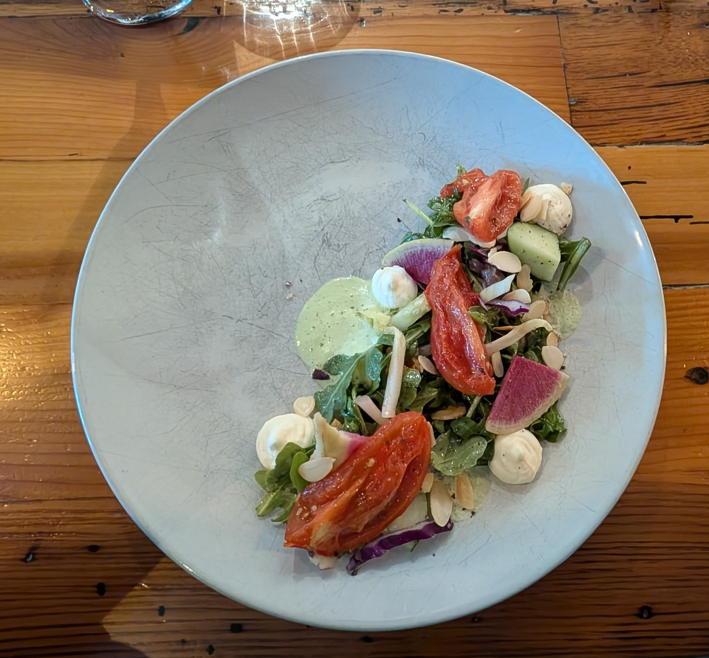
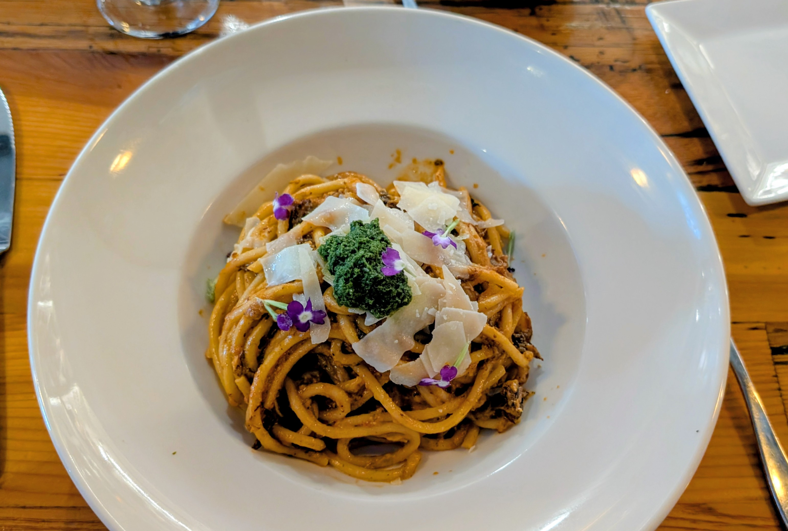
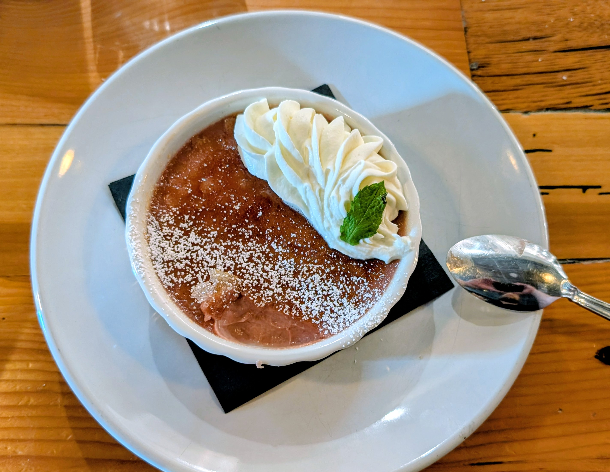

This writing was a review I left on Google Maps after a particularly good experience I had at this establishment. Enjoy 

The mark of any good restaurant is delicious food and accommodating staff. At a James Beard award winner excellent food, wonderful cocktails, beautiful presentation, and professional, knowledgeable, personable staff are literally table stakes. At 1010 I have found the mark of true greatness. 

Tonight, I sat at the bar and was greeted by my new super hero's BB (spelling?) and Derick. I treated myself to an absolutely fabulous Manhattan made by Derick, some really stellar blistered shishitos, and a lovely ramp salad. Afterwards I let Derick "talk me into" a fabulous glass of wine from Cotes De Rhone my absolute favorite wine region in the world, with wine that instantly bring back memories of my late father. 

I could have gotten up and left just then and been perfectly happy. But, if that had come to pass I would not be writing this message and although I would have accounted myself lucky, this evening successful, and my pallet/belly totally satisfied. I would have missed out on a truly unforgettable night. I would have missed the opportunity to see the sort of greatness, compassion, and hospitality that drive me to find restaurants like this.

For you see, I stayed for an entree. Why is this notable? Why have I written 200 words to tell you I had an entree? Because, while eating I had the misfortune to discover a small issue with my meal.

More surprised than anything I alerted BB and, before I could blink, my plate was whisked away. I was offered and brought what Derick knew was my second choice of entree. My entire meal was comped including the dessert I BEGGED to be allowed to pay for. I was rebuffed multiple times when I offered. I had 3 different people come and ask if I was ok. I was made to feel extra special. 

You see, the mark of REAL greatness in the restaurant industry is not how you handle the table stakes. In large part it's not even really the incredible food you make. Its how you handle adversity, how you correct mistakes, and how you treat people. We're all human, mistakes happen the only thing that matters in the world is how we treat each other when mistakes happen. 

Eat, drink, and be merry 
Do it at 1010 Bridge
You won't be disappointed

~ Corey